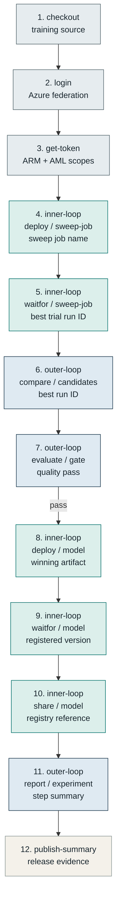
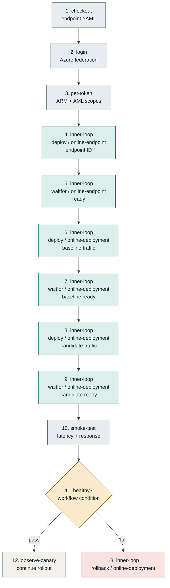
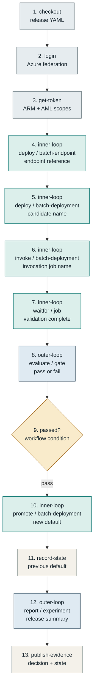
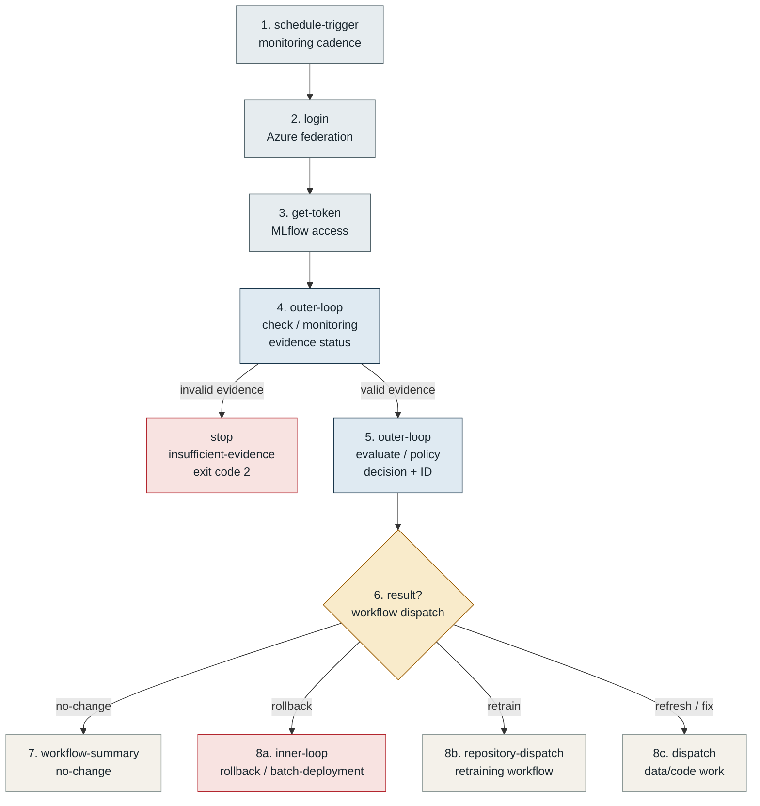
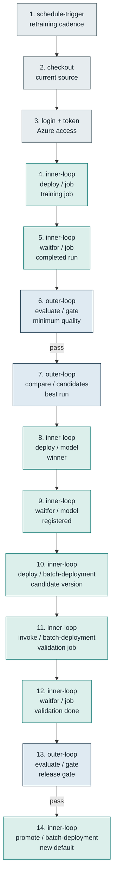
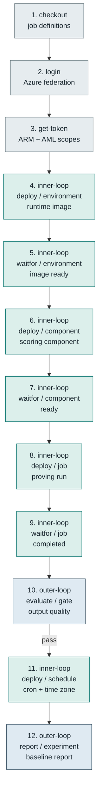
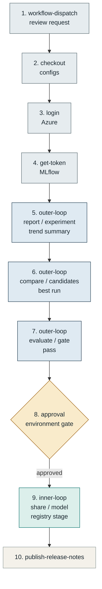
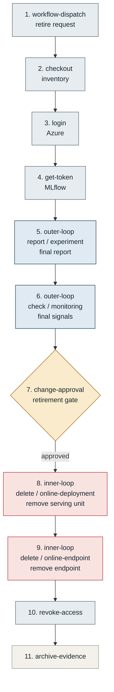

# Ten machine learning workflow sequences

Illustrative end-to-end paths through the Azure ML inner-loop and outer-loop actions. Each sequence stays at workflow-step level so developers can see which action, verb, and subject combinations are available without getting buried in input details.

> A styled, printable version of this document is available at [workflow-sequences.html](workflow-sequences.html).

## How to read this

- **Top to bottom.** Numbered nodes show execution order.
- **Branches are illustrative.** GitHub workflow conditions connect separate action invocations.
- **Diagrams are Mermaid.** They render directly on GitHub; the HTML version uses SVG.

## Contents

- [Sequence grammar](#sequence-grammar)
- [01 Train and register a governed baseline](#01-train-and-register-a-governed-baseline)
- [02 Sweep, compare, and publish the best model](#02-sweep-compare-and-publish-the-best-model)
- [03 Build a reusable registry stack](#03-build-a-reusable-registry-stack)
- [04 Blue-green online release with compensation](#04-blue-green-online-release-with-compensation)
- [05 Validate and promote a batch model](#05-validate-and-promote-a-batch-model)
- [06 Monitor production and dispatch policy action](#06-monitor-production-and-dispatch-policy-action)
- [07 Scheduled retraining and batch replacement](#07-scheduled-retraining-and-batch-replacement)
- [08 Provision a recurring scoring or feature job](#08-provision-a-recurring-scoring-or-feature-job)
- [09 Review experiments and approve registry promotion](#09-review-experiments-and-approve-registry-promotion)
- [10 Retire an online solution with evidence](#10-retire-an-online-solution-with-evidence)
- [Command coverage](#command-coverage)

## Sequence grammar

One node is one workflow step. Platform steps show only their action name. Inner-loop and outer-loop nodes add the command as `verb / subject`. The second line of a node names the important hand-off, such as a resource ID, run ID, prior default, or decision result.

| Node kind | Meaning | Typical steps |
| --- | --- | --- |
| Platform | Repository and Azure plumbing | checkout, login, get-token, approval |
| Inner loop | Asset and deployment lifecycle | deploy, waitfor, share, invoke, promote, rollback, delete |
| Outer loop | Evidence and decisions | evaluate, compare, report, check |
| Decision | Workflow condition or human gate | `if:` expression, protected environment |
| Compensation | Rollback or destructive cleanup | rollback, delete, stop |

## 01 Train and register a governed baseline

Build every workspace asset explicitly, run training, enforce a metric gate, and register the resulting model only after the run passes.

**Outcome:** a reproducible model version backed by provisioned data, environment, component, and run evidence. Workspace-first training path, 14 workflow steps.

```mermaid
flowchart TD
    n1["1. checkout<br/>repository source"]
    n2["2. login<br/>Azure federation"]
    n3["3. get-token<br/>ARM + AML scopes"]
    n4["4. inner-loop<br/>deploy / data<br/>data reference"]
    n5["5. inner-loop<br/>waitfor / data<br/>ready version"]
    n6["6. inner-loop<br/>deploy / environment<br/>environment ID"]
    n7["7. inner-loop<br/>waitfor / environment<br/>image ready"]
    n8["8. inner-loop<br/>deploy / component<br/>component version"]
    n9["9. inner-loop<br/>waitfor / component<br/>provisioned"]
    n10["10. inner-loop<br/>deploy / job<br/>training job name"]
    n11["11. inner-loop<br/>waitfor / job<br/>completed run"]
    n12["12. outer-loop<br/>evaluate / gate<br/>pass or fail"]
    n13["13. inner-loop<br/>deploy / model<br/>model version"]
    n14["14. inner-loop<br/>waitfor / model<br/>registered"]

    n1 --> n2 --> n3 --> n4 --> n5 --> n6 --> n7
    n7 --> n8 --> n9 --> n10 --> n11 --> n12
    n12 -- pass --> n13 --> n14

    class n1,n2,n3 platform
    class n4,n5,n6,n7,n8,n9,n10,n11,n13,n14 inner
    class n12 outer

    classDef platform fill:#e6ecef,stroke:#52646b,color:#18252d
    classDef inner fill:#dcefeb,stroke:#006f69,color:#18252d
    classDef outer fill:#dfeaf2,stroke:#18354a,color:#18252d
```

- **Blocking rule:** only run `deploy / model` when the gate output is `pass`.
- **Lineage:** the training job records source and workflow metadata for the model candidate.
- **Use when:** a project creates all assets in one workspace and values explicit readiness checks.

## 02 Sweep, compare, and publish the best model

Run hyperparameter optimization, retrieve the best trial, compare candidate runs, enforce quality, then register and share the winner.

**Outcome:** a registry model selected from measured candidates rather than from a fixed training run. Hyperparameter optimization path, 12 workflow steps.

- **Candidate hand-off:** `best-trial-run-id` and `best-run-id` make selection explicit.
- **Registry hand-off:** `share / model` can promote the asset to a configured registry stage.
- **Use when:** training explores multiple parameter combinations and one version must be published centrally.

## 03 Build a reusable registry stack

Provision related assets in a workspace, wait for materialization, then share data, environment, component, and model versions into a central Azure ML registry.

**Outcome:** a reusable, versioned foundation that other model repositories can consume without rebuilding every dependency. Workspace-to-registry path, 14 workflow steps.

```mermaid
flowchart TD
    n1["1. checkout<br/>asset YAML"]
    n2["2. login<br/>Azure federation"]
    n3["3. get-token<br/>ARM scope"]
    n4["4. inner-loop<br/>deploy / data<br/>workspace version"]
    n5["5. inner-loop<br/>waitfor / data<br/>ready"]
    n6["6. inner-loop<br/>share / data<br/>registry data ref"]
    n7["7. inner-loop<br/>deploy / environment<br/>workspace image"]
    n8["8. inner-loop<br/>waitfor / environment<br/>image ready"]
    n9["9. inner-loop<br/>share / environment<br/>registry env ref"]
    n10["10. inner-loop<br/>deploy / component<br/>workspace version"]
    n11["11. inner-loop<br/>waitfor / component<br/>ready"]
    n12["12. inner-loop<br/>share / component<br/>registry component"]
    n13["13. inner-loop<br/>deploy / model<br/>workspace model"]
    n14["14. inner-loop<br/>share / model<br/>registry model"]

    n1 --> n2 --> n3 --> n4 --> n5 --> n6 --> n7
    n7 --> n8 --> n9 --> n10 --> n11 --> n12 --> n13 --> n14

    class n1,n2,n3 platform
    class n4,n5,n6,n7,n8,n9,n10,n11,n12,n13,n14 inner

    classDef platform fill:#e6ecef,stroke:#52646b,color:#18252d
    classDef inner fill:#dcefeb,stroke:#006f69,color:#18252d
```

- **Dependency hand-off:** use the shared environment reference when sharing a component that depends on it.
- **Version discipline:** every shared resource remains an explicit version rather than an implicit latest asset.
- **Use when:** a platform team publishes reusable assets for multiple model teams.

## 04 Blue-green online release with compensation

Create an online endpoint, deploy a baseline, add a candidate with limited traffic, and either continue observation or restore the previous deployment.

**Outcome:** a controlled online rollout with an explicit failure path rather than an improvised traffic change. Online serving path, 13 steps plus branch.

- **Traffic control:** `deploy / online-deployment` accepts a traffic allocation for the candidate.
- **Rollback target:** pass the previous deployment explicitly when deterministic recovery matters.
- **Use when:** an HTTP inference service needs staged exposure and a fast compensating action.

## 05 Validate and promote a batch model

Create a batch endpoint and versioned candidate deployment, invoke it on pinned validation data, gate the resulting evidence, and switch the endpoint default.

**Outcome:** a named batch deployment promoted with a recorded previous default and an expected-current guard. Versioned batch release path, 13 workflow steps.

- **Pinned validation:** `invoke / batch-deployment` names the deployment and input path explicitly.
- **Concurrency guard:** promotion receives the default the workflow expects to replace.
- **Rollback evidence:** persist `previous-deployment-name` for a deterministic future rollback.

## 06 Monitor production and dispatch policy action

Read the latest production evidence, validate it, evaluate a versioned policy, and route the result to no-change, rollback, retraining, or another remediation workflow.

**Outcome:** an auditable automatic decision that fails closed when monitoring evidence is missing, stale, undersized, or mismatched. Production control path, 8 steps plus policy branches.

- **Fail closed:** invalid evidence stops before policy dispatch and returns exit code 2.
- **Idempotency:** `decision-id` can deduplicate downstream workflow dispatch.
- **Use when:** a production model is monitored continuously and policy controls remediation.

## 07 Scheduled retraining and batch replacement

Train on a cadence, evaluate and compare candidates, register the winner, create a new batch deployment, validate it, and promote it as the endpoint default.

**Outcome:** a recurring model refresh that joins training evidence to a guarded batch release. Recurring train-to-release path, 14 workflow steps.

- **Two gates:** one gate protects model quality; the second protects release behavior on pinned data.
- **Endpoint serialization:** use a GitHub concurrency group keyed by batch endpoint during promotion.
- **Use when:** a batch model must refresh regularly without automatically replacing production on training success alone.

## 08 Provision a recurring scoring or feature job

Build the runtime and component, execute one proving run, evaluate its output, then register an Azure ML schedule for recurring execution.

**Outcome:** a scheduled workload whose environment, component, and first execution were verified before automation begins. One-time proof before recurring execution, 12 workflow steps.

- **Prove first:** the schedule is created only after one manually submitted job reaches success.
- **Time semantics:** `deploy / schedule` receives the cron expression and time zone explicitly.
- **Use when:** scoring, feature generation, data refresh, or evaluation must recur on a fixed cadence.

## 09 Review experiments and approve registry promotion

Generate an experiment report, rank candidate runs, enforce the evaluation gate, then place a human approval before sharing the selected model.

**Outcome:** a lightweight governance path where evidence is automated but the final registry promotion remains accountable to a reviewer. Evidence-assisted human promotion, 10 workflow steps.

- **Evidence bundle:** the report, ranking, gate summary, and selected run are available to the reviewer.
- **Human boundary:** use a protected GitHub environment or equivalent approval mechanism before sharing.
- **Use when:** risk, regulation, or organizational policy requires a named approver for promotion.

## 10 Retire an online solution with evidence

Collect final experiment and monitoring evidence, require a change approval, remove the deployment before its endpoint, then archive the retirement record.

**Outcome:** an online service is decommissioned in dependency order with evidence retained for audit and support. Evidence-first retirement path, 11 workflow steps.

- **Dependency order:** remove the online deployment before deleting the endpoint that contains it.
- **Evidence retention:** archive final experiment, monitoring, approval, and deletion outputs together.
- **Use when:** a model endpoint reaches end of life, migrates, or is replaced by another service.

## Command coverage

The scenarios intentionally repeat important controls while spanning every current action verb and nearly every major subject. This is an option map, not a requirement that every workflow use every step.

### Inner-loop combinations shown

| Verb | Subjects |
| --- | --- |
| `deploy` | `data`, `environment`, `component`, `model`, `job`, `sweep-job`, `schedule`, `online-endpoint`, `online-deployment`, `batch-endpoint`, `batch-deployment` |
| `waitfor` | `data`, `environment`, `component`, `model`, `job`, `sweep-job`, `online-endpoint`, `online-deployment` |
| `share` | `data`, `environment`, `component`, `model` |
| `invoke` | `batch-deployment` |
| `promote` | `batch-deployment` |
| `rollback` | `batch-deployment`, `online-deployment` |
| `delete` | `online-deployment`, `online-endpoint` |

### Outer-loop combinations shown

| Verb | Subjects |
| --- | --- |
| `evaluate` | `gate`, `policy` |
| `compare` | `candidates` |
| `report` | `experiment` |
| `check` | `monitoring` |

### Common platform steps shown

`checkout`, `login`, `get-token`, `schedule-trigger`, `workflow-dispatch`, `approval`, `smoke-test`, `repository-dispatch`, `publish-summary`

> **Illustrative, not copy-paste YAML.**
> Real workflows still need concrete action versions, Azure resource identifiers, token outputs, config file paths, GitHub permissions, environment protection, concurrency groups, and failure handling appropriate to the model's risk.
